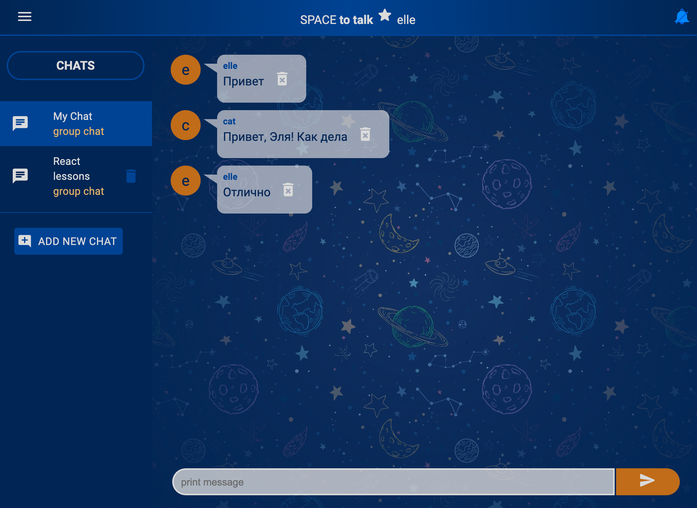
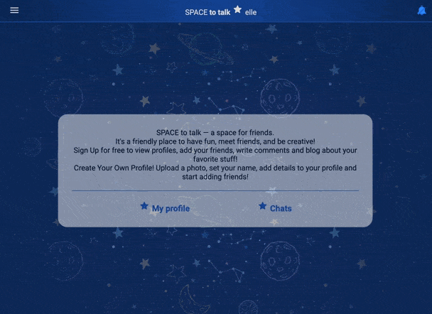

# Messenger on React

Messenger (front) is a simple training project for getting started with React


[demo](https://spacetotalk.herokuapp.com/)





## Available Scripts

In the project directory, you can:

## Project setup
```
npm install
```

### Compiles and hot-reloads for development
```
npm run serve
```
Runs the app in the development mode.\
Open [http://localhost:8080](http://localhost:8080) to view it in the browser.
The page will reload if you make edits.


### Compiles and minifies for production
```
npm run build
```
Builds the app for production to the `build` folder.\
It correctly bundles React in production mode and optimizes the build for the best performance.

The build is minified and the filenames include the hashes.\
Your app is ready to be deployed!


